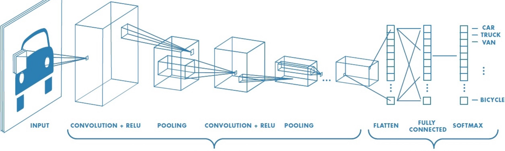

# Biome Image Classification
This repo docuemnts the codes and documentations for Biome and season image classifier. A convolutional neural network (CNN) and residual neural network (ResNet) (https://en.wikipedia.org/wiki/Residual_neural_network) is used for learning the image patters and classifying them. A ResNet is an artificial neural network (ANN) of a kind that builds on constructs known from pyramidal cells in the cerebral cortex. Residual neural networks do this by utilizing skip connections, or short-cuts to jump over some layers.
Below the concept of CNN is presented: 

The main building block of CNN is the convolutional layer. Convolution is a mathematical operation to merge two sets of information. In our case the convolution is applied on the input data using a convolution filter to produce a feature map.

How resnet works:
Deep learning layers by default only talk to their neighbirs, Resnet allows all deep learning layers to talk to each other and not only their neighbors. 

## Requirements 
All codes are written in Python, to run the code and model, the following packages are used so far:
- PyTorch  https://pytorch.org/
- ResNet
- Pickle
- Pandas 
- Numpy 
- PIL
- skimage
