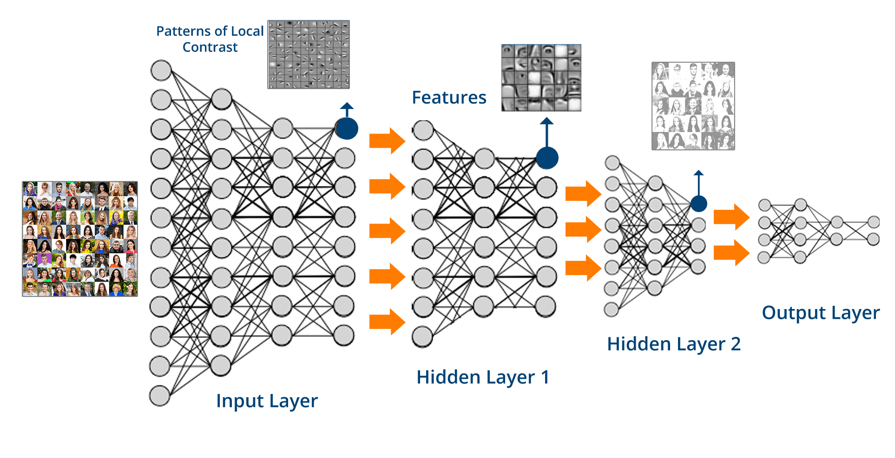

# Biome Image Classification
This repo docuemnts the codes and documentations for Biome and season image classifier. A convolutional neural network is used for learning the image patters and classifying them.

## Requirements 
All codes are written in Python, to run the code and model, the following packages are used so far:
- PyTorch  https://pytorch.org/
- Pandas 
- Numpy 
