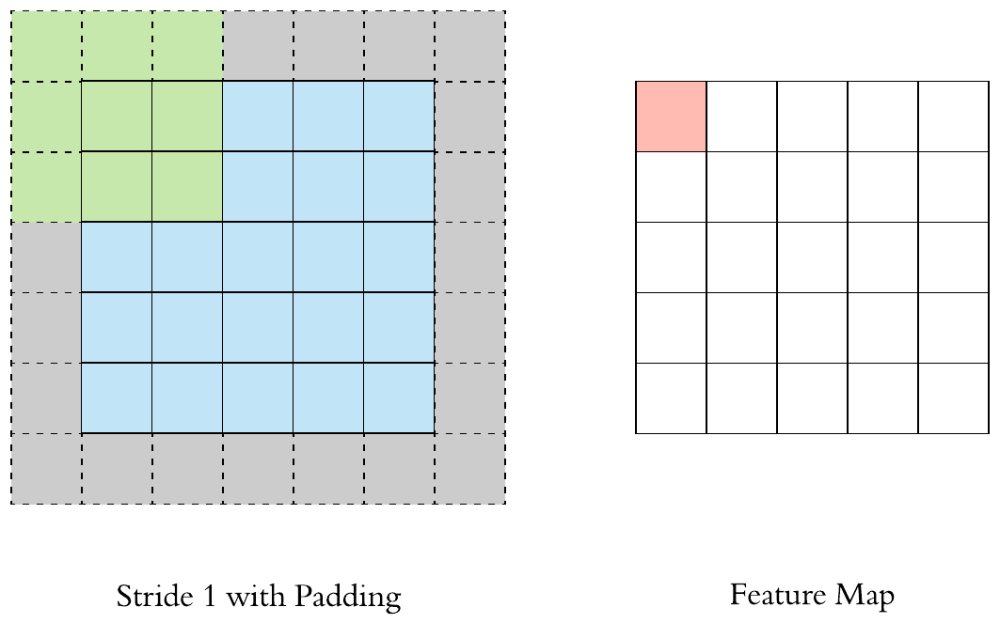

# Getting started
This repo contains the code and dataset used to build an image classifier. The model takes an image as input and predicts the biome and season of the image. The model is a Pytorch deep learning model that uses both CNN and Resnet networks, more details about each can is described below. 

For building a model we first need to clean the dataset. "dataset_preproc.py" file prepares all the images for training and "train.ipynb" builds the pytorch model. To run a prediction on any image the "predict.ipynb" script should be used. This file uses the prebuild model (pytorch_model) available in this repo. 

# Using the Code
- Install all the dependencies. 
- Install Anaconda Notebooks
- Open the predict jupyter file (predict.ipynb)
- Make sure that the model file (pytorch_model) is in the same directory as the script
- Make sure the image you want to test is in the correct directory
- Modify the jupyter file with the image name you want to run

For calculating most frequesnt colors in an image:
- Use "Hex2Name.ipynb" script (This script uses an SKlearn KNN ML model for calculating the most frequent colors in an image) 

# Deep Learning Network
This repo docuemnts the codes and documentations for Biome and season image classifier. A residual neural network (ResNet) with convolutional neural network (CNN) (https://en.wikipedia.org/wiki/Residual_neural_network) is used for learning the image patters and classifying them.

Below the concept of CNN is presented: 

The main building block of CNN is the convolutional layer. Convolution is a mathematical operation to merge two sets of information. In our case the convolution is applied on the input data using a convolution filter to produce a feature map.

How resnet works:
A ResNet is an artificial neural network (ANN) of a kind that builds on constructs known from pyramidal cells in the cerebral cortex. Residual neural networks do this by utilizing skip connections, or short-cuts to jump over some layers. Traditional Deep learning layers only talk to their neighbors, But Resnet allows deep learning layers to talk to one another and not only their neighbors. 

## Dependencies
All codes are written in Python, to run the code and model, the following packages are required:
- PyTorch, SKlearn, ResNet, Pickle, Pandas, Numpy, PIL, Skimage
